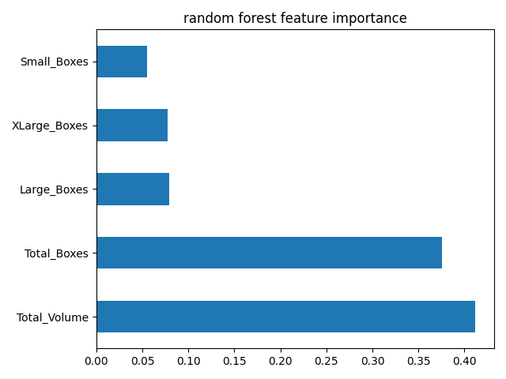

# Kimchi_price_prediction

## Project Overview
**Goal of the Project**
- Predicting the price of Kimchi

**Dataset**
- Representing prices of kimchi during the first three months of 2018
- The dataset is identified by their specifications such as Date, Price, Total Volume, Total Boxes, Small Boxes, Large Boxes, XLarge Boxes, Region
- For effective training, post processing was carried out
- Dataset can be found at:
    |Version|Link|
    |------|---|
    |Origin dataset|[link](https://github.com/easy-note/Kimchi_price_prediction/blob/main/dataset/Kimchi_dataset.xlsx)|
    |Post processing dataset|[link](https://github.com/easy-note/Kimchi_price_prediction/blob/main/dataset/final_kimchi_dataset.csv)|

- Train/Test split
The experiment was conducted with the best configuraion split for each model. In the case of LSTM, both versions were experimented and document was prepared based on [Split 2] (because the performance was better)
    - [Split 1] Random Forest, XGBoost, LightGBM (,LSTM)
        - Train (nine weeks)
            - 2018-01-07 ~ 2018-03-04
        - Test (three weeks)
            - 2018-03-11 ~ 2018-03-25
    - [Split 2] LSTM
        - Train (two months)
            - 2018-01-07 ~ 2018-02-25
        - Test (one month)
            - 2018-03-04 ~ 2018-03-25

**Machine Learning / Deep Leraning Techniques which I used**
- Random Forest
- XGBoost
- LightGBM
- LSTM
---

### __Develop Environment__
- Code editor : Visual Studio code (remote)
- OS : Ubuntu 20.04.4 LTS
- GPU : NVIDIA Tesla V100
- Docker
- Programming Language : Python 3.8
- Deep Learning Framework : Pytorch 1.8.0

### __How to Set Up Your Environment__
1. Creating docker image   
Run where the Docker file is located
```
docker build -t <docker_img_name> .
```
2. Creating docker container & attach
```
docker run -it --name <docker_contianer_name> -v <mng_path:mnt_path> --runtime=nvidia --gpus all --shm-size=512g <docker_img_name>
```
3. Install requirement.txt 
```
pip install -r requirements.txt
```

### __Usage__
- Data preprocessing
    - To check kimchi price data by region (Nothing to do with training. To view data statistics)   
    - Command :
        ```
        python ./utils/data_preprocessing/per_region_statistics.py
        ```
    - Data preprocessing
        - Remove outliers
        - Remove missing data
        - Calculate the average [Price, Total Volume, Total Boxes, Small Boxes, Large Boxes, XLarge Boxes] **by date**
        - Command :
        ```
        python ./utils/data_preprocessing/preprocessing.py
        ```

- Run Model
    - Experimented with Random Forest, XGBoost, LightGBM, LSTM
    - Results are created in  `./code/results/<model>` directory
    - Command : 
    - Random Forest
        ```
        python ./apis/random_forest_code.py
        ```
    - XGBoost
        ```
        python ./apis/xgboost_code.py
        ```
    - LightGBM
        ```
        python ./apis/lightgbm_code.py
        ```
    - LSTM (split 2)
        ```
        python ./apis/lstm_code.py
        ```
    - LSTM (split 1)
        ```
        python ./apis/lstm_code_split1.py
        ```

### __Result__
Output results for each model are as follows.
- Random Forest
    - `./code/results/random_forest/rf_prediction.png` : Kimchi price prediction
        
    - `./code/results/random_forest/results.csv` : Kimchi price prediction value
    - `./code/results/random_forest/rf_feature_importance.png` : Feature importance 
        
- XGBoost
    - `./code/results/xgboost/xgboost.png` : Kimchi price prediction
        
    - `./code/results/xgboost/results.csv` : Kimchi price prediction value
    - `./code/results/xgboost/xgboost.png` : Feature importance
        
- LightGBM
    - `./code/results/lgbm/rf_prediction.png` : Kimchi price prediction
        
    - `./code/results/lgbm/results.csv` : Kimchi price prediction value
    - ~~`./code/results/lgbm/rf_feature_importance.png` : Feature importance~~
- LSTM (split 2)
    - `./code/results/lstm/lstm.png` : Kimchi price prediction
        
    - `./code/results/lstm/results.csv` : Kimchi price prediction value
    - `./code/results/lstm/loss.png` : Feature importance
        
    - `./code/results/lstm/my_lstm.pth` : Train model
    - Trained LSTM model can be found at [Google Drive](https://drive.google.com/drive/folders/1M9O_6qcGzWAF9yD87w-IDMJ-iGzWIgRc?usp=share_link):

### Evalutaion
Evaluation Metric : RMSE (Root Mean Square Error)
- Random Forest `0.015957208104115706`
- XGBoost `0.00765481312057859`
- LightGBM `0.04308578938377058`
- LSTM (split 2) `0.00964891162457928`